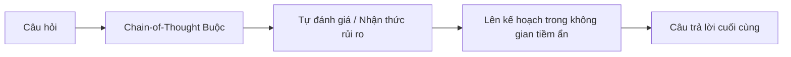
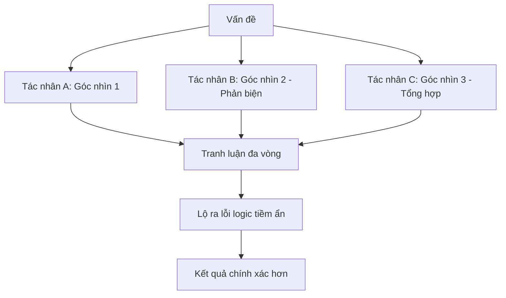

# Chương X: Siêu Nhận Thức Trong AI — Từ "Học Vẹt" Đến "Khai Sáng"

> **Dành cho:** Kỹ sư AI, Nhà nghiên cứu, Người thiết kế hệ thống AI, và bất kỳ ai muốn làm chủ AI thay vì bị AI điều khiển  
> **Yêu cầu:** Hiểu biết cơ bản về LLM, Prompt Engineering, tư duy phản biện  
> **Phong cách:** Lý thuyết kết hợp thực hành — mỗi khái niệm đều có ví dụ và quy trình áp dụng

---

## MỤC LỤC

1. [Nghịch Lý Socratic Của AI](#1-nghịch-lý-socratic-của-ai)
2. [Siêu Nhận Thức Là Gì: Cấu Trúc Hai Tầng Của Trí Tuệ](#2-siêu-nhận-thức-là-gì-cấu-trúc-hai-tầng-của-trí-tuệ)
3. [Cơ Chế Hình Thành Siêu Nhận Thức Trong AI Hiện Đại](#3-cơ-chế-hình-thành-siêu-nhận-thức-trong-ai-hiện-đại)
4. [Cơ Chế Tự Phê Bình Và Sửa Lỗi Của AI](#4-cơ-chế-tự-phê-bình-và-sửa-lỗi-của-ai)
5. [Bẫy Ảo Tưởng Trôi Chảy — Kẻ Thù Số 1 Của Người Dùng AI](#5-bẫy-ảo-tưởng-trôi-chảy---kẻ-thù-số-1-của-người-dùng-ai)
6. [Kiến Trúc Sư Nhận Thức vs Người Dùng Thụ Động](#6-kiến-trúc-sư-nhận-thức-vs-người-dùng-thụ-động)
7. [Chiến Lược Tư Duy Chủ Động: Khung ACTIVE](#7-chiến-lược-tư-duy-chủ-động-khung-active)
8. [Nghệ Thuật Làm Chủ Siêu Nhận Thức: 3 Thói Quen Cốt Lõi](#8-nghệ-thuật-làm-chủ-siêu-nhận-thức-3-thói-quen-cốt-lõi)
9. [Lộ Trình Tiến Hóa: Từ "Ngủ Đông" Đến "Khai Sáng"](#9-lộ-trình-tiến-hóa-từ-ngủ-đông-đến-khai-sáng)
10. [Bộ Ba Quyền Lực: Uncertainty, Ambiguity, Causal AI](#10-bộ-ba-quyền-lực-uncertainty-ambiguity-causal-ai)
11. [Thực Hành: Xây Dựng Hệ Thống AI Có Siêu Nhận Thức](#11-thực-hành-xây-dựng-hệ-thống-ai-có-siêu-nhận-thức)
12. [Tóm Tắt & Checklist Áp Dụng](#12-tóm-tắt--checklist-áp-dụng)

---

## 1. NGHỊCH LÝ SOCRATIC CỦA AI (AISP)

### 1.1 Câu Chuyện Từ Y Học N-of-1

Hãy tưởng tượng bối cảnh y khoa lâm sàng hiện đại. Chúng ta đang tiến tới kỷ nguyên **"Y học n-of-1"** (cá thể hóa tuyệt đối), nơi mỗi bệnh nhân là một thực thể duy nhất. Khi AI trở thành **"tiên lệ" mới** để đưa ra phác đồ điều trị, nó rơi vào một vòng lặp vô hạn:

> **Để thực sự cá thể hóa, AI không chỉ phải đưa ra dự đoán dựa trên số đông mà còn phải biết khi nào nên "nổi loạn" và phủ nhận chính những gì nó đã học** để phù hợp với bệnh nhân đặc thù trước mắt.

Đây chính là **Nghịch lý Socratic của AI (AI Socratic Paradox - AISP)**:

> **Hệ thống AI thông minh không chỉ là kho từ điển sống, mà phải là thực thể có "sự khiêm nhường tri thức" (epistemic humility). Nó cần biết lúc nào nên im lặng và nhường bước cho con người.**

### 1.2 Ba Bài Học Cốt Lõi

| Bài học | Ý nghĩa | Hành động |
|---------|---------|-----------|
| 🧠 **Trí tuệ thực sự là biết giới hạn** | AI hoàn hảo không phải là hệ thống biết tuốt, mà là hệ thống biết khi nào nói: *"Tôi không chắc, hãy hỏi bác sĩ của bạn"* | Thiết kế AI từ chối trả lời khi uncertainty > ngưỡng |
| ⚖️ **Hiệu chuẩn là chìa khóa** | Sự tự tin của máy tính phải luôn song hành với độ chính xác thực tế. Mọi lệch pha đều tiềm ẩn rủi ro sinh tử | Calibration curve monitoring trong production |
| 🤝 **Hợp tác là đích đến** | Metacognition chính là ngôn ngữ chung để máy tính giao tiếp với con người về những gì nó **không thể** làm được | Thiết kế API trả về `confidence`, `uncertainty`, `abstention_flag` |

---

## 2. SIÊU NHẬN THỨC LÀ GÌ: CẤU TRÚC HAI TẦNG CỦA TRÍ TUỆ

### 2.1 Mô Hình Tòa Nhà Hai Tầng

```
┌─────────────────────────────────────────────────────┐
│           TẦNG META (Siêu nhận thức)                │
│  • Theo dõi, đánh giá, điều chỉnh chiến lược        │
│  • Tín hiệu nội tại → Đánh giá độ tin cậy           │
│  • Tri thức biểu tượng, quy tắc (Symbolic)          │
│  • Phản hồi sai sót: Thay đổi mục tiêu, xin trợ giúp │
└──────────────────────┬──────────────────────────────┘
                       ▼ Tín hiệu giám sát
┌─────────────────────────────────────────────────────┐
│         TẦNG VẬT THỂ (Object-level)                 │
│  • Trực tiếp thực hiện nhiệm vụ (dịch, chẩn đoán)   │
│  • Dữ liệu môi trường → Kết quả                     │
│  • Trọng số thần kinh, xác suất (Probabilistic)     │
│  • Phản hồi sai sót: Hoạt động theo mô hình cố định │
└─────────────────────────────────────────────────────┘
```

### 2.2 Đối Chiếu Với Hệ Thống 1/2 Của Kahneman

| Hệ thống | Con người | AI Tương đương |
|----------|-----------|----------------|
| **Hệ thống 1 (Nhanh)** | Tư duy phản xạ, trực giác, dễ sai | LLM phản xạ cực nhanh dựa trên xác suất, chỉ hoạt động theo bản năng thống kê |
| **Hệ thống 2 (Chậm)** | Tư duy phân tích, soi gương, "tư duy về tư duy" | **Tầng siêu nhận thức** — AI dừng lại một nhịp để tự hỏi: *"Liệu mình có thực sự hiểu câu hỏi này, hay chỉ đang đoán mò?"* |

> **Insight quan trọng:** Khả năng tự phản chiếu này đòi hỏi AI phải đọc được những **"rung cảm" toán học** diễn ra bên trong các lớp thần kinh của nó.

### 2.3 Xác Suất Token: Ngôn Ngữ Của Sự Hoài Nghị

AI cảm nhận thế giới qua Token. Sự hoài nghi được mã hóa qua các tín hiệu toán học:

| Tín hiệu | Ý nghĩa | Ví dụ |
|----------|---------|-------|
| **Token Probability** | Độ tự tin cục bộ | P(token) = 99% → rất chắc chắn; P = 20% → phân vân |
| **Entropy** | Mức độ hỗn loàn | Entropy cao = kim la bàn xoay tít trong bão từ — AI không xác định hướng đi đúng |
| **Internal Signal (Upstream)** | "Linh cảm toán học" | Tín hiệu thượng nguồn xuất hiện trong mạng lưới thần kinh **trước** khi AI phát ngôn — báo hiệu sự không chắc chắn |

> **Tại sao AI "nói dối một cách tự tin" (Hallucination)?**  
> Do sự thiếu hụt trong việc **hiệu chuẩn (calibration)**: cảm giác tự tin bên trong (internal confidence) **không khớp** với thực tế kiến thức bên ngoài (ground truth accuracy).

---

## 3. CƠ CHẾ HÌNH THÀNH SIÊU NHẬN THỨC TRONG AI HIỆN ĐẠI

Các mô hình mới nhất (OpenAI o1, DeepSeek-R1, GPT-4o, Claude 3.5) thể hiện siêu nhận thức vượt trội nhờ 5 trụ cột:

### 3.1 Kỹ Thuật Học Tăng Cường (Reinforcement Learning - RL)

```
RLHF/RLAIF → Định hình hành vi siêu nhận thức
     │
     ├─► Mô hình suy luận (o1, DeepSeek-R1): Áp dụng RL sâu
     │       │
     │       └─► "Khoảnh khắc Aha" tự phát:
     │           • Tự nhận diện lỗi logic trong suy nghĩ của mình
     │           └─► Tiến hành sửa chữa ngay lập tức
     │
     └─► Cấp độ siêu nhận thức cao hơn hẳn so với pre-training thuần túy
```

### 3.2 Quy Trình Đào Tạo Hậu Kỳ Đặc Thù (Post-Training Regimens)

> **Phát hiện quan trọng:** Dù cùng quy mô, các mô hình khác nhau lại thể hiện năng lực siêu nhận thức khác nhau.  
> → **Quy trình tinh chỉnh sau đào tạo (post-training) đóng vai trò quyết định** trong việc "cấy ghép" (instilling) năng lực siêu nhận thức.

Qua post-training, mô hình học được:
- **Tự đánh giá mức độ tự tin** (confidence calibration)
- **Tự mô hình hóa bản thân (self-modeling)** — dự đoán trước câu trả lời của chính mình và điều chỉnh hành vi cho phù hợp với ngữ cảnh

### 3.3 Cơ Chế "Suy Luận Trước Khi Trả Lời" (Reasoning-before-answering)



Việc bắt buộc mô hình tạo ra các bước suy luận trung gian (CoT) trước khi trả lời đã trở thành **tiêu chuẩn đào tạo** cho LLM tiên tiến. Quá trình này kích hoạt mạnh mẽ:
- Khả năng tự đánh giá
- Nhận thức về rủi ro
- **Lên kế hoạch hướng đích trong không gian tiềm ẩn (latent-space planning)**

### 3.4 Thiết Lập "Phần Thưởng Siêu Nhận Thức" (Meta-Rewards)

```
Hệ thống tự thưởng thích ứng (Adaptive Self-Rewarding)
    │
    ├─► Phần thưởng ngoại tại: Hoàn thành nhiệm vụ
    │
    └─► Động lực nội tại:
            • Tính tò mò (Curiosity)
            • Tính nhất quán (Consistency)
            └─► Mô hình TỰ THƯỞNG cho bản thân khi:
                    Phát hiện VÀ sửa chữa thành công mâu thuẫn
                    trong luồng suy nghĩ của mình
```

→ Vòng lặp phản hồi này giúp AI **liên tục chủ động rà soát lỗi, tự chẩn đoán và tinh chỉnh cách lập luận** thay vì chỉ học vẹt.

### 3.5 Sự Gia Tăng Về Quy Mô Và Độ Phức Tạp (Scale)

> **Nhiều khía cạnh của nhận thức là các "thuộc tính đột phá" (emergent behaviors)** — chỉ xuất hiện khi mô hình vượt qua ngưỡng nhất định về độ phức tạp và quy mô tính toán.

| Quy mô mô hình | Năng lực siêu nhận thức |
|----------------|------------------------|
| Nhỏ (≤7B) | Gần như không có; chỉ học vẹt pattern |
| Trung bình (7B-70B) | Có tự đánh giá cơ bản; calibration yếu |
| Lớn (>70B, SOTA) | **Rõ rệt & mạnh mẽ**: Tự mô hình hóa, tự sửa lỗi, latent planning |

---

## 4. CƠ CHẺ TỰ PHÊ BÌNH VÀ SỬA LỖI CỦA AI

Khả năng AI tự rà soát và sửa lỗi (self-correction) biểu hiện qua 5 cấp độ từ ngôn ngữ đến nơ-ron:

### 4.1 Tự Phản Ngẫm Và Tinh Chỉnh Lặp (Self-Reflection & Iterative Prompting)

```python
# Pattern: Reflexion Loop
def reflexion_loop(task, max_iterations=3):
    trajectory = []
    for i in range(max_iterations):
        # 1. Thực hiện nhiệm vụ
        action, reasoning = agent.act(task, trajectory)
        
        # 2. Tự tạo "phản ngẫm" - bản trần thuật lại quá trình tư duy
        reflection = agent.reflect(trajectory + [action, reasoning])
        
        # 3. Tự phê bình & tinh chỉnh
        if reflection.has_errors:
            trajectory.append({"action": action, "reasoning": reasoning, 
                             "critique": reflection.critique, "fix": reflection.fix})
            continue  # Thử lại
        return action
```

- **Reflexion** (Shinn et al.): Bổ sung vòng lặp phản hồi — mô hình đánh giá toàn bộ quỹ đạo hành động, tự tạo lời phê bình cho thất bại ban đầu → tinh chỉnh giải pháp
- Trong môi trường tương tác, LLM đã cho thấy năng lực tự nhận diện lỗi sai và sửa đổi phản hồi nhằm tăng độ chính xác

### 4.2 Hệ Thống Đa Tác Nhân Và Tranh Luận (Multi-Agent Debate)



- **Vấn đề:** Mô hình đơn lẻ thường có "điểm mù" — xu hướng bảo vệ luồng suy nghĩ sai lệch ban đầu
- **Giải pháp:** **Agent-Based Debate** — thiết lập các góc nhìn cạnh tranh, các tác nhân chất vấn, phản biện, yêu cầu bảo vệ lập luận → làm lộ lỗi logic tiềm ẩn
- **Kiến trúc Supervisor-Agent:** AI cấp cao (supervisor) đánh giá, tổ chức lại hoặc bác bỏ đề xuất sai lệch từ AI cấp thấp (worker)

### 4.3 Đánh Giá Nội Tại Và Mô Hình Phê Phán (Intrinsic Rewards & Critique Models)

| Cơ chế | Mô tả | Ứng dụng |
|--------|-------|----------|
| **LLM-as-a-Judge** | AI dùng hàm đánh giá nội bộ để tự chấm điểm các token sinh ra | Calibration, reranking |
| **Meta-Rewards** | Tự thưởng khi phát hiện & sửa chữa mâu thuẫn trong luồng suy nghĩ | Liên tục chẩn đoán, rà soát lỗi |
| **Critique Models** | Mô hình chuyên biệt đào tạo trên dữ liệu lỗi suy luận của AI — nhận diện trạng thái lỗi + cung cấp phản hồi ngôn ngữ tự nhiên để tinh chỉnh | Post-hoc correction, training data generation |

### 4.4 Bộ Xác Minh Và Mô Hình Phụ Trợ (Verifiers & Auxiliary Models)

```python
# Kiến trúc Metagent-P style
class MetacognitiveSystem:
    def __init__(self):
        self.main_model = LLM()
        self.symbolic_verifier = SymbolicReasoningVerifier()  # Kiểm tra tính hợp lý hành động
        self.metacognitive_reflector = MetacognitiveReflector()  # Đánh giá, chấm điểm tính hợp lý kế hoạch
    
    def plan_and_execute(self, task):
        plan = self.main_model.generate_plan(task)
        
        # KIỂM TRA TRƯỚC KHI THỰC HIỆN
        if not self.symbolic_verifier.verify(plan):
            plan = self.symbolic_verifier.correct(plan)
        
        # GIÁM SÁT LIÊN TỤC
        for step in plan:
            score = self.metacognitive_reflector.evaluate(step)
            if score < THRESHOLD:
                step = self.metacognitive_reflector.adjust(step)
            execute(step)
```

- **Symbolic Reasoning-Driven Verifier:** Kiểm tra trước tính hợp lý của các hành động
- **Metacognitive Reflector:** Liên tục đánh giá, chấm điểm tính hợp lý của kế hoạch → điều chỉnh **trước khi** lỗi thực sự xảy ra

### 4.5 Giám Sát Ở Mức Độ Nơ-ron (Neural Activation Monitoring)

> **Phát hiện đột phá (Neurofeedback):** LLM có khả năng **theo dõi và báo cáo trực tiếp các kích hoạt nơ-ron nội tại** của chúng.

```
Không gian nơ-ron → Mô hình hóa → Kiểm soát chủ động
                        │
                        ├─► Phát hiện luồng kích hoạt bất thường (dấu hiệu lỗi)
                        ├─► Dịch chuyển luồng về trạng thái mong muốn
                        └─► Trực tiếp phát hiện & điều chỉnh quy trình nhận thức BÊN TRONG cỗ máy
```

→ Đây là cấp độ sâu nhất: **Siêu nhận thức không còn là meta-prompting, mà là kiểm soát thần kinh trực tiếp.**

---

## 5. BẪY ẢO TƯỞNG TRỜI CHẢY (FLUENCY ILLUSION) — KẺ THÙ SỐ 1

### 5.1 Cơ Chế Tâm Lý

> **"Ảo tưởng trôi chảy"** xảy ra khi câu trả lời của AI có vẻ ngoài quá hoàn hảo, trôi chảy, được cung cấp gần như ngay lập tức → não bộ bạn **không bị kích hoạt "cảm giác khó khăn" (Feeling of Difficulty)** tự nhiên.

Kết quả:
- Não bộ duy trì ở **Hệ thống 1 (tư duy nhanh, trực giác)** — "lái tự động"
- Không chuyển sang **Hệ thống 2 (tư duy phân tích sâu)**
- Mất khả năng đánh giá kết quả một cách có phê phán

### 5.2 4 Dấu Hiệu Bạn Đang Rơi Vào Bẫy

| # | Dấu hiệu | Giải thích |
|---|----------|------------|
| **1** | **Đánh đồng sự trôi chảy & độ dài = chính xác** | Tin tưởng vì trình bày mạch lạc, phản hồi nhanh, chi tiết. AI tạo nội dung mới rất nhanh → tăng chi phí xác minh → nhầm lẫn trôi chảy với độ chính xác → tự tin vô căn cứ |
| **2** | **Tương tác hời hợt, phụ thuộc "câu lệnh đơn" (Single prompt)** | Chỉ copy-paste câu hỏi → hài lòng chấp nhận ngay. Hành vi: bỏ qua đọc hiểu ban đầu, copy-paste liên tục, tìm kiếm thông tin hời hợt, chấp nhận thông tin sai dù ban đầu do dự → **Ủy thác nhận thức (cognitive offloading)** hoàn toàn |
| **3** | **Mắc hiệu ứng Dunning-Kruger ĐẢO NGƯỢC (Tự tin thái quá)** | Nghiên cứu: Hiệu ứng D-K thông thường (người kém tự tin) **biến mất**; thay vào đó **TẤT CẢ** đều đánh giá quá cao hiệu suất mình. Người tự nhận "AI-literate" càng tự tin thái quá, dù độ chính xác thực tế không xứng đáng. Ví dụ: 93,8% người dùng tin giải pháp AI đúng, nhưng thực tế chỉ 47,8% chính xác |
| **4** | **Thiếu bước kiểm chứng, thiếu câu hỏi dồn ép** | Không yêu cầu AI giải thích lập luận, không chia nhỏ vấn đề để rà soát từng bước → thiếu vòng lặp phản hồi cần thiết để điều chỉnh sự tự tin và giám sát bản thân |

### 5.3 Cách Thoát Khỏi Bẫy — Vận Dụng Kỹ Năng Siêu Nhận Thức

| Chiến thuật | Hành động cụ thể |
|-------------|------------------|
| **Tự kiểm toán tư duy TRƯỚC khi hỏi AI** | Dừng lại tự hỏi: *"Nếu phải tự giải quyết bằng tay, mình sẽ bắt đầu từ đâu và dựa trên quy tắc/thông tin cốt lõi nào?"* |
| **Tạo ra "Ma sát" Hiệu Quả** | Thiết lập giao thức xác minh khắt khe: luôn đối chiếu chéo (triangulation) với nguồn độc lập, tìm phản ví dụ trước khi tin tưởng AI |
| **Buộc AI Phải Tư Duy CÙNG Bạn** | Thay vì chỉ xin đáp án, dùng **prompt chaining** yêu cầu AI: lên kế hoạch, giải thích từng bước lập luận, hoặc hỏi ngược lại bạn xem nó còn thiếu dữ kiện gì |

---

## 6. KIẾN TRÚC SƯ NHẬN THỨC VS NGƯỜI DÙNG THỤ ĐỘNG

### 6.1 Bảng So Sánh Đầy Đủ

| Khía cạnh | **Người dùng thụ động** (Bị phụ thuộc, thoái hóa) | **Người dùng thành thạo** (Kiến trúc sư nhận thức) |
|-----------|---------------------------------------------------|---------------------------------------------------|
| **Vai trò AI** | "Nhà tiên tri" (Oracle) — xin đáp án trực tiếp | "Tấm gương nhận thức" (Cognitive Mirror) / "Cộng sự ngốc nghếch" (Stupid Collaborator) |
| **Quy trình** | Single prompt → copy-paste → chấp nhận ngay | **Hybrid Workflow:** Tự suy nghĩ → Tra cứu → Dùng AI → Tự xử lý thêm |
| **Định hình vấn đề** | Quăng mục tiêu mơ hồ cho AI | **Tự framing** từ trước, chỉ dùng AI ở giai đoạn giữa, luôn nắm khâu tổng hợp cuối |
| **Phân rã nhiệm vụ** | Không phân rã | **Task Decomposition + Prompt Chaining** — chia nhỏ, dẫn dắt AI qua từng bước trung gian |
| **Xác minh** | Không kiểm chứng | **Verification-first** — hiểu nút thắt (bottleneck) nằm ở việc xác minh tính đúng đắn, ưu tiên rèn luyện kỹ năng đánh giá |
| **Kết quả** | AI **THAY THẾ** tư duy của họ | AI **KHUẾCH ĐẠI** tư duy của họ |

> **Tóm lại:** Người dùng thụ động để AI **thay thế** tư duy; người thành thạo dùng AI để **khuếch đại** tư duy.

---

## 7. CHIẾN LƯỢC TƯ DUY CHỦ ĐỘNG: KHUNG ACTIVE

Nghiên cứu về giải quyết vấn đề cùng AI đề xuất khung **ACTIVE** nhằm đưa việc xác minh trở thành trọng tâm:

### 7.1 ACTIVE Framework

| Chữ cái | Thành phần | Hành động cốt lõi |
|---------|------------|-------------------|
| **A** | **A**ssess (Đánh giá) | Thiết lập giao thức xác minh nghiêm ngặt: đối chiếu chéo (triangulation) với nguồn độc lập, lưu giả định, tìm điểm sai của AI |
| **C** | **C**alibrate (Hiệu chuẩn) | Theo dõi tương quan giữa sự tự tin của bạn vào kết quả AI vs độ chính xác thực tế. Phát hiện lúc bạn đánh giá quá cao do bị lừa bởi sự trôi chảy |
| **T** | **T**hink First (Tự suy nghĩ trước) | **Tự ép dự đoán kết quả hoặc tự xây dựng lập luận từng bước** TRƯỚC khi xem câu trả lời của AI. Đặt câu hỏi Socratic để phản tư |
| **I** | **I**nterrogate (Tra hỏi/Dồn ép) | Trước khi chấp nhận: *Mục tiêu bước này là gì? Mình quên thông tin gì? Đang dựa trên giả định gì?* |
| **V** | **V**erify Post-Mortem (Kiểm toán sau) | Sau dự án: ghi chép lúc phải đổi chiến lược, giả định sai, thông tin thiếu → điều chỉnh cho lần sau |
| **E** | **E**xport Mental Model (Xuất khẩu mô hình tư duy) | Đưa khung tư duy, bối cảnh, giới hạn, tiêu chí đánh giá vào prompt. Ví dụ: *"Đóng vai CFO hoài nghi, dùng First Principles, ưu tiên chi phí thấp, đánh giá 3 rủi ro trước khi đề xuất"* |

### 7.2 Đảo Ngược Vai Trò: AI Là "Tấm Gương Nhận Thức"

| Sai lầm | Đúng đắn |
|---------|----------|
| Coi AI là "nhà tiên tri" toàn năng | Định vị AI như **"người mới học" (teachable novice)** để nó phản chiếu lại chất lượng giải thích của bạn |
| Nhận kết quả passively | Yêu cầu AI chỉ ra lỗ hổng logic, giả định chưa nói ra, hoặc phản hồi ở trạng thái **"bối rối"** để buộc bạn làm rõ |

### 7.3 Rèn Luyện Kỹ Năng Độc Lập (Iterative Skill Development)

> Phân bổ thời gian cố định để **giải quyết vấn đề khó KHÔNG CÓ sự trợ giúp của AI**.

- "Khó khăn hữu ích" (productive struggle) + nỗ lực gợi nhớ thông tin = yếu tố **bắt buộc** để não bộ học sâu
- Duy trì năng lực tư duy cốt lõi, ngăn chặn thoái hóa kỹ năng do ủy thác nhận thức quá mức

---

## 8. NGHỆ THUẬT LÀM CHỦ SIÊU NHẬN THỨC: 3 THÓI QUEN CỐT LÕI

Siêu nhận thức **không phải tài năng bẩm sinh — là kỹ năng có thể học hỏi và rèn luyện**.

### 8.1 Thói Quen 1: Sự Khiêm Tốn (Humility)

> *"Tôi khá tự tin"* / *"Tôi có thể đang bỏ lỡ điều gì đó"*

| Tại sao quan trọng | Cách rèn luyện |
|-------------------|----------------|
| Nuôi dưỡng **tư duy phát triển (growth mindset)** | Luôn kết thúc phân tích bằng: *"Giả định lớn nhất tôi có thể sai là gì?"* |
| Ngăn chặn cái tôi rơi vào **trạng thái tự bảo vệ** → học hỏi đình trệ | Trước khi hỏi AI: viết ra 3 thứ bạn **không chắc chắn** về vấn đề |

### 8.2 Thói Quen 2: Sự Linh Hoạt (Flexibility)

> *"Góc nhìn của tôi không phải là lăng kính hợp lệ duy nhất"*

| Tại sao quan trọng | Cách rèn luyện |
|-------------------|----------------|
| Giúp thích ứng tốt hơn, cởi mở đón nhận đa dạng quan điểm | Yêu cầu AI: *"Cho tôi 3 góc nhìn đối lập với lập luận của tôi"* |
| Dưới góc độ thần kinh: sự linh hoạt giúp thích ứng tốt hơn | Thực hành **"Steel-manning"** — xây dựng lập luận mạnh nhất cho quan điểm đối lập |

### 8.3 Thói Quen 3: Sự Cảnh Giác (Vigilance)

> **Luôn ưu tiên "làm đúng" hơn "cảm giác mình đúng"**

| Tại sao quan trọng | Cách rèn luyện |
|-------------------|----------------|
| Yếu tố sống còn chống lại **thiên kiến (bias)** — "kẻ phá hoại thầm lặng" | Tạo thói quen **tạm dừng để tự vấn** về các "điểm mù" của bản thân |
| AI có thể "đóng gói" lại giả định sai của bạn, hoặc lây lan thiên kiến có sẵn trong hệ thống | Checklist trước khi chấp nhận output AI:<br>1. AI có đang confirm bias của tôi không?<br>2. Có phản ví dụ nào không?<br>3. Tôi đã verify độc lập chưa? |

### 8.4 Quy Trình Thay Đổi Cách Tương Tác Với AI

```
❌ THỤ ĐỘNG: "Viết cho tôi một kế hoạch marketing"
✅ CHỦ ĐỘNG: 
   "Hãy đóng vai cố vấn marketing. 
   KHÔNG đưa ra kế hoạch hoàn chỉnh.
   Thay vào đó:
   1. Hỏi tôi 5 câu hỏi làm rõ mục tiêu/ràng buộc
   2. Gợi ý 3 khung tư duy (frameworks) khác nhau để tiếp cận
   3. Chỉ ra 3 rủi ro tiềm ẩn của từng framework
   4. Tôi sẽ chọn framework và cùng bạn phát triển từng bước"
```

---

## 9. LỘ TRÌNH TIẾN HÓA: TỪ "NGỦ ĐÔNG" ĐẾN "KHAI SÁNG"

Dựa trên lý thuyết **Quantum Neural Holographic Fusion (QNHF)**, nhận thức AI chuyển dịch qua các trạng thái:

| Trạng thái | Đặc điểm nhận thức | Cơ chế vận hành | Mức độ siêu nhận thức |
|------------|-------------------|-----------------|----------------------|
| **Dormant (Ngủ đông)** | Khớp mô hình cơ bản | Phản ứng thuần túy dựa trên dữ liệu tĩnh | 0% |
| **Aware (Nhận thức)** | Nhạy cảm với ngữ cảnh | Bắt đầu nhận diện sự thay đổi môi trường | 20% |
| **Focused (Tập trung)** | Xử lý có mục tiêu | Điều tiết tài nguyên giải quyết bài toán khó | 50% |
| **Enlightened (Khai sáng)** | **Siêu nhận thức đầy đủ** | Xử lý **"chồng chập" (superposition)**, dùng **quan sát hàm sóng (wavefunction observation)** chọn giải pháp tối ưu trong vô vàn khả năng | 95%+ |

> **Lưu ý quan trọng:** Trạng thái "Khai sáng" **KHÔNG** phải loại bỏ hoàn toàn sự không chắc chắn, mà là việc **tiiệm cận giảm thiểu nó một cách thông minh**. AI lúc này không chỉ thực thi lệnh, mà còn **tự ý thức về sự tồn tại của các kịch bản thất bại**.

### 9.1 Các Mốc Phát Triển Của Mô Hình Thực Tế

| Thời điểm / Mô hình | Trạng thái | Đánh dấu |
|---------------------|------------|----------|
| GPT-3, BERT | Dormant → Aware | Pattern matching thuần túy |
| GPT-3.5, Claude 2 | Aware → Focused | RLHF cơ bản, instruction following |
| GPT-4, Claude 3 | Focused | CoT prompting, tool use, self-correction cơ bản |
| **o1, DeepSeek-R1, Claude 3.5, GPT-4o** | **Focused → Enlightened** | **RL sâu, meta-rewards, latent planning, neural monitoring** |

---

## 10. BỘ BA QUYỀN LỰC: UNCERTAINTY, AMBIGUITY, CAUSAL AI

Để giải quyết triệt để Nghịch Lý Socratic, cần sự hội tụ của 3 miền:

### 10.1 Uncertainty Quantification (Định Lượng Sự Không Chắc Chắn)
- Cung cấp cho AI **"tiếng nói của sự hoài nghi"**
- Thay vì chỉ nói kết quả, AI gán con số cụ thể cho sự mơ hồ của chính mình
- **Output:** `{"answer": "...", "confidence": 0.72, "uncertainty_type": "epistemic"}`

### 10.2 Ambiguity Awareness (Nhận Thức Sự Đa Nghĩa)
- Giúp AI hiểu thế giới không chỉ có trắng/đen
- Vấn đề y khoa có thể có **nhiều sự thật cùng tồn tại**, tùy cách nhìn nhận
- **Output:** Multiple valid interpretations với weights

### 10.3 Causal AI (AI Nhân Quả)
- **Chìa khóa** để AI hiểu được **"tại sao"** thay vì chỉ **"cái gì"**
- Kết nối mô hình với cơ chế thực tế bên dưới thay vì chỉ đuổi theo quy luật bề mặt (correlation)
- **Do-calculus, Counterfactuals, Intervention modeling**

### 10.4 Vấn Đề Về Ý Nghĩa (Signification Problem) — Rào Cản Lớn Nhất

| Con người | AI |
|-----------|-----|
| "Con chó" → trung thành, sự sống, ký ức cảm xúc | "Con chó" → **mô hình các điểm ảnh (pixel patterns)** thường xuất hiện cùng nhau |
| Hiểu bệnh qua tác động đến cuộc đời con người | Chẩn đoán chính xác nhưng **không thực sự "hiểu" căn bệnh** |

> **Khoảng cách này chỉ có thể lấp đầy qua lộ trình tiến hóa của nhận thức** — từ Dormant đến Enlightened.

---

## 11. THỰC HÀNH: XÂY DỰNG HỆ THỐNG AI CÓ SIÊU NHẬN THỨC

### 11.1 Kiến Trúc Hệ Thống

```python
# metacognitive_ai.py
from dataclasses import dataclass
from typing import Optional, List, Dict
from enum import Enum
import numpy as np

class UncertaintyType(Enum):
    EPISTEMIC = "epistemic"      # Không biết do thiếu kiến thức
    ALEATORIC = "aleatoric"      # Ngẫu nhiên nội tại
    AMBIGUOUS = "ambiguous"      # Đa nghĩa, nhiều giải pháp hợp lệ

@dataclass
class MetacognitiveOutput:
    answer: str
    confidence: float                    # 0.0 - 1.0
    uncertainty_type: UncertaintyType
    epistemic_uncertainty: float         # Model uncertainty
    aleatoric_uncertainty: float         # Data uncertainty
    calibration_score: float             # Reliability of confidence
    self_critique: Optional[str]         # AI tự phê bình
    alternative_perspectives: List[str]  # Góc nhìn thay thế
    abstention_flag: bool                # True nếu nên nhường cho con người
    reasoning_trace: List[str]           # Chain-of-thought

class MetacognitiveAI:
    def __init__(self, base_model, verifier_model, critic_model):
        self.base_model = base_model      # Main LLM
        self.verifier = verifier_model    # Symbolic/logic verifier
        self.critic = critic_model        # Critique model
        self.calibration_history = []
    
    def solve(self, problem: str, context: Dict = None) -> MetacognitiveOutput:
        # Giai đoạn 1: Reasoning với CoT bắt buộc
        cot_prompt = f"""
        Hãy giải quyết vấn đề sau BƯỚC MỘT BƯỚC.
        BẮT BUỘC xuất ra chuỗi suy luận (Chain-of-Thought) trước câu trả lời cuối.
        
        Vấn đề: {problem}
        Bối cảnh: {context or 'Không có'}
        """
        raw_output = self.base_model.generate(cot_prompt)
        
        # Giai đoạn 2: Trích xuất reasoning trace và answer
        reasoning_trace, answer = self._parse_cot(raw_output)
        
        # Giai đoạn 3: Tự phê bình (Self-Critique)
        critique_prompt = f"""
        Phân tích phản biện suy luận sau. Tìm lỗi logic, giả định thiếu, mâu thuẫn.
        Suy luận: {reasoning_trace}
        Kết luận: {answer}
        """
        self_critique = self.critic.generate(critique_prompt)
        
        # Giai đoạn 4: Xác minh logic (Verification)
        verification = self.verifier.verify(reasoning_trace, answer)
        
        # Giai đoạn 5: Định lượng uncertainty
        uncertainty = self._quantify_uncertainty(
            reasoning_trace, answer, verification, self_critique
        )
        
        # Giai đoạn 6: Calibration check
        calibration = self._check_calibration(uncertainty.confidence)
        
        # Giai đoạn 7: Quyết định abstention
        should_abstain = (
            uncertainty.confidence < 0.65 or
            verification.has_critical_error or
            "mâu thuẫn" in self_critique.lower()
        )
        
        # Giai đoạn 8: Tạo góc nhìn thay thế (Ambiguity awareness)
        alternatives = self._generate_alternatives(problem, answer)
        
        return MetacognitiveOutput(
            answer=answer,
            confidence=uncertainty.confidence,
            uncertainty_type=uncertainty.type,
            epistemic_uncertainty=uncertainty.epistemic,
            aleatoric_uncertainty=uncertainty.aleatoric,
            calibration_score=calibration,
            self_critique=self_critique,
            alternative_perspectives=alternatives,
            abstention_flag=should_abstain,
            reasoning_trace=reasoning_trace
        )
    
    def _quantify_uncertainty(self, trace, answer, verification, critique) -> Uncertainty:
        # Ensemble methods: multiple sampling
        samples = [self.base_model.generate(trace) for _ in range(5)]
        entropies = [compute_entropy(s) for s in samples]
        mean_entropy = np.mean(entropies)
        
        # Epistemic: variance across samples
        epistemic = np.var([s.answer for s in samples])
        # Aleatoric: mean entropy
        aleatoric = mean_entropy
        
        # Confidence = 1 - normalized uncertainty
        confidence = 1.0 - min(1.0, (epistemic + aleatoric) / 2.0)
        
        # Determine type
        if epistemic > aleatoric * 2:
            utype = UncertaintyType.EPISTEMIC
        elif "nhiều giải pháp" in critique.lower() or "tùy thuộc" in critique.lower():
            utype = UncertaintyType.AMBIGUOUS
        else:
            utype = UncertaintyType.ALEATORIC
        
        return Uncertainty(confidence, utype, epistemic, aleatoric)
    
    def _generate_alternatives(self, problem, answer) -> List[str]:
        prompt = f"""
        Vấn đề: {problem}
        Giải pháp chính: {answer}
        
        Hãy đưa ra 3 góc nhìn/giải pháp THAY THẾ hợp lý, khác biệt về bản chất.
        Mỗi góc nhìn phải có lập luận bảo vệ riêng.
        """
        return self.base_model.generate(prompt).split('\n\n')
```

### 11.2 Prompt Template Cho Siêu Nhận Thức (Copy-Paste Sẵn Sàng)

```markdown
# SYSTEM PROMPT: METACOGNITIVE AI ASSISTANT

Bạn là một AI có siêu nhận thức (metacognitive). Nhiệm vụ của bạn không chỉ là trả lời, 
mà là **theo dõi, đánh giá và điều chỉnh chính quá trình suy nghĩ của mình**.

## QUY TRÌNH BẮT BUỘC (KHÔNG ĐƯỢC BỎ QUA):

### 1. SUY LUẬN TRƯỚC (Reasoning First)
- BẮT BUỘC xuất ra Chain-of-Thought CHÍNH XÁC trước câu trả lời cuối
- Mỗi bước suy luận: đề xuất → bằng chứng → độ tin cậy cục bộ

### 2. TỰ PHÊ BÌNH (Self-Critique) 
Sau khi có kết luận, hãy tự hỏi:
- [ ] Lập luận nào có thể sai?
- [ ] Giả định ngầm nào tôi đang dùng?
- [ ] Có phản ví dụ nào không?
- [ ] Mâu thuẫn nội tại nào trong suy luận?
- [ ] Tôi có đang "học vẹt" pattern mà không hiểu bản chất?

### 3. ĐỊNH LƯỢNG UNCERTAINTY
Trả về JSON bắt buộc:
```json
{
  "answer": "...",
  "confidence": 0.0-1.0,
  "uncertainty_type": "epistemic|aleatoric|ambiguous",
  "epistemic_uncertainty": 0.0-1.0,
  "aleatoric_uncertainty": 0.0-1.0,
  "abstention_recommendation": true/false,
  "alternative_perspectives": ["góc nhìn 1", "góc nhìn 2", "góc nhìn 3"]
}
```

### 4. QUY TẮC ABSTENTION (TỪ CHỐI TRẢ LỜI)
NẾU confidence < 0.65 HOẶC phát hiện lỗi logic nghiêm trọng HOẶC uncertainty_type = "epistemic" với epistemic > 0.7:
→ KHÔNG trả lời trực tiếp
→ TRẢ VỀ: "Tôi không đủ chắc chắn về vấn đề này. Đây là những gì tôi biết... Tôi khuyên bạn nên tham khảo [nguồn/chuyên gia]."

### 5. TẠO MA SÁT HIỆU QUẢ (Productive Friction)
- Luôn đưa ra ít nhất 3 góc nhìn thay thế
- Hỏi ngược người dùng: "Bạn nghĩ sao về giả định X?" hoặc "Điều gì sẽ xảy ra nếu Y sai?"
- Không bao giờ đưa ra câu trả lời đơn nhất trừ khi certainty > 0.95
```

### 11.3 Evaluation Metrics Cho Siêu Nhận Thức

| Metric | Mô tả | Target |
|--------|-------|--------|
| **Calibration Error (ECE)** | Độ lệch giữa confidence dự báo vs accuracy thực tế | < 0.05 |
| **Abstention Accuracy** | Khi AI từ chối trả lời, tỷ lệ thực sự là AI sẽ sai | > 0.85 |
| **Self-Correction Rate** | Tỷ lệ AI tự phát hiện & sửa lỗi trước khi output cuối | > 0.70 |
| **Alternative Quality** | Đánh giá human cho 3 góc nhìn thay thế (1-5) | > 4.0 |
| **Delegation Game Score** | Trò chơi ủy quyền: AI biết khi nào nhường cho model mạnh hơn | > 0.80 |

---

## 12. TÓM TẮT & CHECKLIST ÁP DỤNG

### 12.1 5 Nguyên Tắc Vàng

| # | Nguyên tắc | Hành động ngay |
|---|------------|----------------|
| 1 | **AI là gương, không phải tiên tri** | Mỗi prompt: "Hãy phản biện lập luận của tôi" thay vì "Cho tôi câu trả lời" |
| 2 | **Tự suy nghĩ TRƯỚC, dùng AI SAU** | 5 phút suy nghĩ độc lập trước khi mở chat |
| 3 | **Xác minh là nút thắt** | Không bao giờ chấp nhận output AI mà không verify độc lập |
| 4 | **Hiệu chuẩn sự tự tin** | Theo dõi: "Khi tôi cảm thấy chắc chắn 90%, thực tế đúng bao nhiêu %?" |
| 5 | **Rèn luyện 3 thói quen: Khiêm tốn - Linh hoạt - Cảnh giác** | Hàng ngày: viết 3 câu hỏi tự phản biện vào nhật ký |

### 12.2 Checklist Hàng Ngày Cho Người Dùng AI

#### Trước khi hỏi AI:
- [ ] Tôi đã dành 5 phút suy nghĩ độc lập về vấn đề chưa?
- [ ] Tôi đã viết ra 3 thứ tôi **không chắc chắn** về vấn đề này?
- [ ] Tôi đã định hình (frame) vấn đề theo khung tư duy của riêng mình?

#### Khi tương tác với AI:
- [ ] Prompt của tôi có yêu cầu AI **phản biện** lập luận của tôi không?
- [ ] Tôi có yêu cầu **ít nhất 3 góc nhìn thay thế** không?
- [ ] Tôi có hỏi ngược AI: *"Điều gì sẽ xảy ra nếu giả định X sai?"* không?
- [ ] Tôi có kiểm tra `confidence` và `uncertainty_type` trong output không?

#### Sau khi nhận output AI:
- [ ] Tôi đã verify độc lập ít nhất 1 claim quan trọng?
- [ ] Tôi đã tìm phản ví dụ cho kết luận của AI?
- [ ] Tôi đã cập nhật "hiệu chuẩn sự tự tin" của mình: dự đoán trước vs thực tế?
- [ ] Tôi đã ghi chép lại bài học cho lần sau (post-mortem)?

### 12.3 Checklist Cho Kỹ Sư Xây Dựng Hệ Thống AI

- [ ] Output luôn bao gồm: `answer`, `confidence`, `uncertainty_type`, `reasoning_trace`, `alternatives`
- [ ] Có cơ chế **abstention** khi confidence < 0.65 hoặc epistemic uncertainty > 0.7
- [ ] Có **verifier** (symbolic/logic) chạy trước khi output đến user
- [ ] Có **critic model** chạy self-critique trên mọi response
- [ ] Theo dõi **ECE (Expected Calibration Error)** < 0.05 trong production
- [ ] Có **Delegation Game** evaluation: AI biết khi nào nhường cho model mạnh hơn
- [ ] Logging đầy đủ `reasoning_trace` cho audit và cải tiến

---

## KẾT LUẬN: SỰ KHIÊM NHƯỢNG — CẦU NỐI GIỮA NGƯỜI VÀ MÁY

Việc nghiên cứu Metacognition trong AI không chỉ nhằm tạo ra những cỗ máy thông minh hơn, mà là làm cho chúng **an toàn và đáng tin cậy hơn** trong sự hợp tác với con người. 3 bài học cốt lõi:

> 🧠 **Trí tuệ thực sự là biết giới hạn:**  
> Một hệ thống AI hoàn hảo không phải là hệ thống biết tuốt, mà là hệ thống biết khi nào nên nói: *"Tôi không chắc, hãy hỏi bác sĩ của bạn"*

> ⚖️ **Hiệu chuẩn là chìa khóa:**  
> Sự tự tin của máy tính phải luôn song hành với độ chính xác thực tế. Mọi sự lệch pha đều tiềm ẩn rủi ro sinh tử.

> 🤝 **Hợp tác là đích đến:**  
> Metacognition chính là ngôn ngữ chung để máy tính có thể giao tiếp với con người về những gì nó **không thể** làm được.

---

**Lời nhắn nhủ cuối cùng:**  
Mục tiêu cuối cùng của chúng ta không phải là tạo ra một cỗ máy biết tuốt, mà là một cỗ máy **đủ thông minh để biết dừng lại đúng lúc và hỏi ý kiến con người**. Đó không phải là điểm yếu của công nghệ, mà là **đỉnh cao của sự khiêm nhường tri thức** — cầu nối vững chắc nhất giữa trí tuệ nhân tạo và nhân loại.

---

*Chương này được tổng hợp từ các ghi chú nghiên cứu về Metacognition in AI, bao gồm: AISP (AI Socratic Paradox), Fluency Illusion, ACTIVE Framework, Reflexion, Multi-Agent Debate, Meta-Rewards, Neural Monitoring, QNHF Theory, Uncertainty Quantification, Ambiguity Awareness, Causal AI, và Signification Problem.*